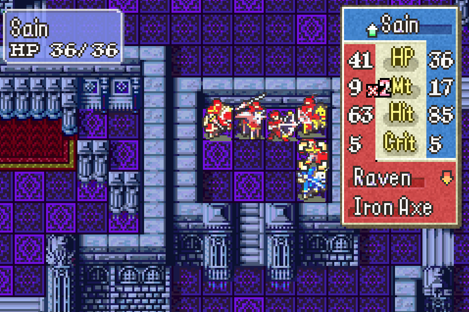

# FE7 Remake (Unity Fan Project)

## Overview

This project is a gameplay-focused remake of **Fire Emblem: The Blazing Blade** built in Unity. It recreates core GBA mechanics while adding new systems such as drafting, custom battle logic, and modernized UI. The goal is to preserve the FE7 feel while enabling new ways to play.

Credit: This project uses assets and resources sourced from the community-driven Fire Emblem repository at https://github.com/Klokinator/FE-Repo.  

## Tutorial

## Features

### Core Systems

- Custom Unity battle engine modeled after GBA FE behavior

- Hit, damage, crit, and weapon triangle calculations

- Sprite-based battle animations with frame-accurate timing

- Stat screen, combat forecast, level-up logic, and UI controllers

  

### Draft & Multiplayer Framework

- Turn-based unit drafting system

- Team assignment and status tracking

- Modular architecture for future PvP or online extensions

  

### Visual & UX Improvements

- Updated HUD, menus, and animations

- Configurable camera logic

- Support for large sprite sheets and advanced spell effects

  

## Tech Stack

-  Unity (URP/WebGL compatible)

- C# for gameplay, UI, and animation drivers

- ScriptableObjects for unit metadata

- Custom pipelines for GBA-style sprite sheets

  

## Repository Structure

Assets/

• Animations/

• BattleAnimations/

• Scripts/ (Combat, Draft, UI, Units)

• Prefabs/

• Scenes/

• Sprites/

Packages/

ProjectSettings/

  

## Building

1. Install Unity 2022.x or newer

2. Clone the repository

3. Open the project through Unity Hub

4. Load any scene under `Scenes/`

5. Press Play

  

### WebGL Build Notes

- Enable WebGL Build Support in Unity Hub

- Set resolution in Player Settings

- Build via File → Build Settings → WebGL

  

## Controls

- Arrow Keys : navigate

- `X` : confirm

- `Z` : cancel
  

## Development Notes

This is a **fan-made, non-commercial** remake for learning and experimentation.

All original IP belongs to Nintendo and Intelligent Systems.

No original game assets are distributed.

  

## Roadmap

- Online PvP prototype

- Improved AI

- Map editor and chapter loader

- Expanded draft modes

- Save/load system

- Replay system

  

## Contributing

This is a personal project, so contributions are limited.

Suggestions and bug reports are welcome.

  

## License

Non-commercial fan work.

Do not redistribute Nintendo/Intelligent Systems assets.
